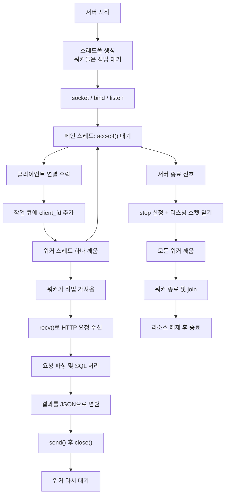

# temp

```mermaid
flowchart TD
    A["서버 시작"] --> B["스레드풀 생성<br/>워커들은 작업 대기"]
    B --> C["socket / bind / listen"]
    C --> D["메인 스레드: accept() 대기"]

    D --> E["클라이언트 연결 수락"]
    E --> F["작업 큐에 client_fd 추가"]
    F --> G["워커 스레드 하나 깨움"]
    G --> D

    G --> H["워커가 작업 가져옴"]
    H --> I["recv()로 HTTP 요청 수신"]
    I --> J["요청 파싱 및 SQL 처리"]
    J --> K["결과를 JSON으로 변환"]
    K --> L["send() 후 close()"]
    L --> M["워커 다시 대기"]

    D --> N["서버 종료 신호"]
    N --> O["stop 설정 + 리스닝 소켓 닫기"]
    O --> P["모든 워커 깨움"]
    P --> Q["워커 종료 및 join"]
    Q --> R["리소스 해제 후 종료"]

```
